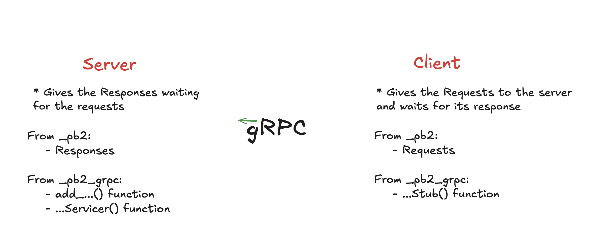

# GRPC with Python

## 🤓 How does this works?

First, initialize a `.proto` file like `example.proto`. 

File Format

- `syntax`: version you're working with
- `package`: name of the .proto file (has to be unique)
- `message`:
    - `Request`: contains the parameters you pass in the function
    - `Response`: Result returned in the function

- `service`: Like the functions combined... Syntax: `rpc function_name(Req) returns (Res)`

> [!IMPORTANT]
> The Request and Response need the values with their respective data types as values.

### Proto example 
```
syntax = "proto3";

package example;

message TTSRequest {
    string text = 1;
    string region = 2;
}

message TTSResponse {
    bytes audio = 1;
}

message STTRequest {
    bytes audio = 1;
}

message STTResponse {
    string transcription = 1;
}


service SpeechRecognition {
    rpc tts(TTSRequest) returns (TTSResponse)
    rpc stt(STTRequest) return (STTResponse)
}
```

After having the `.proto` file ready, un this command:
```sh
python -m grpc_tools.protoc -I. --python_out=. --grpc_python_out=. example.proto 
```


## 🗂️ Files Generated

After running the command, two files should appear.
- `example_pb2.py`
- `example_pb2_grpc.py`

Check them if you wish...

> [!NOTE]
> It will have `example` because it's the name of the proto

### Inside `example_pb2.py` file
There will be the `Responses` and `Requests`

### Inside `example_pb2_grpc.py` file
You will have more functions:
1. The `add_....(servicer, server)` function: Registers a Servicer
2. The `...Servicer(object)` function: Used by server to implement grpc
3. The `...Stub(object)` function: Used by the client to connect to a grpc

> [!WARNING]
> DO NOT edit anything in these files. Don't touch them.


## 🤖 Next Steps 

Now, we need to create the server and the client files. Each one will need different things from the `pb2` files

### ⚙️ Server File
For the server we need...
- From `_pb2`: 
    - Responses

- From `_pb2_grpc`: 
    - `add_....(servicer, server)` function
    - `...Servicer(object)` function

Code: 
```py
# (ALL YOUR IMPORTATIONS FOR FOLLOWING YOUR PROGRAMMING PROCESS)
# ... including the functions from _pb2 and _pb2_grpc

class SpeechRecognitionService(...Servicer): # -> SpeechRecognition is the name we assigned to the service in the proto
    def tts(self, request, context):
        text = request.text
        region = request.region
        ''' PROGRAM 
            LOGIC '''

        return TTSResponse(audio = audio_bytes.getvalue()) # -> its audio because that's what we specified in the TTSResponse in the .proto

    ### DO THE SAME WITH THE OTHER FUNCTIONS ###


# Outside the Class
def serve(): 
    server = grpc.server(futures.ThreadPoolExecutor(max_workers=10))
    # Here we use the add_ function
    add_SpeechRecognitionServicer_to_server(SpeechRecognitionService(), server) # -> again, SpeechRecognition is the name we assigned to the service in the proto
    server.add_insecure_port('[::]:50051')
    server.start()
    server.wait_for_termination()


if __name__ == '__main__':
    serve()
```

> [!NOTE]
> The `tts` function name comes from the .proto as well. Specifically, from the function inside the `service SpeechRecognition`.

Check the whole server in the `server.py` file.


### 🧑‍💻 Client File
For the client we need...
- From `_pb2`: 
    - Requests

- From `_pb2_grpc`: 
    - `...Stub(object)` function

Code:
```py
# (IMPORTATIONS FROM THE _pb2 FILES)

def run_tts(text, region): # -> the two values to make the request
    channel = grpc.insecure_channel('localhost:50051') # -> make sure this match with the server's route
    stub = SpeechRecognitionStub(channel) # -> here we use the ...Stub function

    request = TTSRequest(text=text, region=region)   # -> here the Request, those values are the ones assigned in the .proto file
    response = stub.tts(request) # -> its .tts because that's the name we assigned in the .proto file

    with open('output.wav', 'wb') as f:
        f.write(response.audio) # -> its response.audio because its the value that we assign in the TTSResponse in the .proto file

    print("Audio file saved to output.wav")

### SAME WITH THE OTHER FUNCTIONS ###
```

Check the whole server in the `client.py` file.


## 🧠 Execution
In separate terminal consoles run
```
python server.py
python client.py
```

## 🫣 Just in case...

If an error like this appears:

```sh
TypeError: Descriptors cannot be created directly. 
More infor...: https://developers.google...
```

Then...
1. Run
```sh
pip install protobuff==3.20.1
```

2. Then, run
```sh
export PROTOCOL_BUFFERS_PYTHON_IMPLEMENTATION=python
```


## 🔍 A little summary

