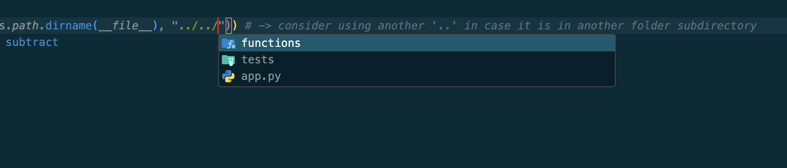

# Dot Dot Pie
Solution for folder importation errors in Python

## ⚙️ Overview
Steps solve the error: `ModuleNotFoundError: No module named <folder_name>`

## 😵‍💫 Why?
Because of your folder structure. 

Example:
Let's suppose you have this folder composition (it's the same in the repo)
```
src
|_ functions
    |_ math_ops.py
|_ tests
    |_ testing_math_ops.py
|_ app.py
```

If you want to import the `math_ops.py` functions inside `testing_math_ops.py` file, and you write something like:
```py
from functions.math_ops import add
```

You will receive the already known error... 

This happens because Python will look for the `functions` folder inside the subdirectory of the file you're running. In this case, it will look inside the `test` folder, where is non-existent.


## 🤓 Solution
Type this before the importation:

```py
# test/test_math_ops.py
import os, sys
sys.path.append(os.path.join(os.path.dirname(__file__), "../"))
```

The `../` means going up one directory, which is what you need to do to find the `functions` folder, right?

Now with these changes, rerun your script. It should work. SHOULD.


### Deeper and deeper
In case you have another folder inside tests like:
```
src
|_ functions
    |_ math_ops.py
|_ tests
    |_ more
        |_ other_test.py
    |_ testing_math_ops.py
|_ app.py
```

And you want to import the `math_ops` functions inside `other_test.py`...

Just continue going up with more dots and slashes.
```py
# test/more/other_test.py
import os, sys
sys.path.append(os.path.join(os.path.dirname(__file__), "../../"))  # -> going up 2 directories
```


> [!TIP]
> In VSCode just start typing the `../` and you will see what folders are available in that directory. Continue until you find the correct one.
